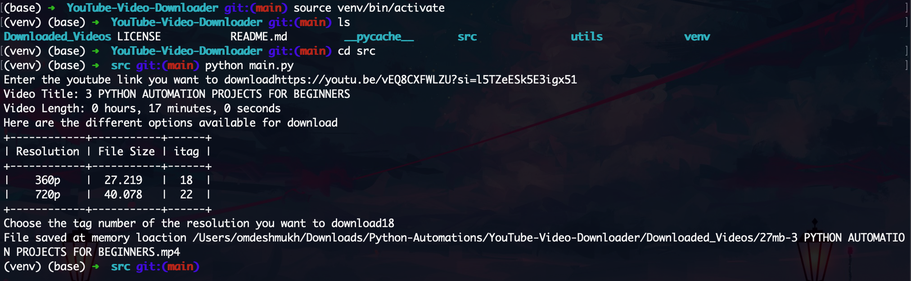

# YouTube Video Downloader
 Downloads youtube videos for you with just a link to the YouTube Video.



## Project Highlights
- Provide with the link of the YouTube Video you want to donwload
- Also, provide further choices for what resolution to download
- The respective YouTube video if exists will be downloaded in the Downloaded_Videos folder

## Libraries Used
The set of python libraries used include the following
- pytube(for the YouTube API)
- re(for regular expressions)
- tabulate(for beautification of terminal)

## Installation
1.Clone this repository to your local machine using:

```bash
  git clone https://github.com/OmSDeshmukh/YouTube-Video-Downloader
```
2.Navigate to the project directory:

```bash
  cd YouTube-Video-Downloader
```

3. Create a virtual environment:

```bash
python3 -m venv venv
```

4. Activate the virtual environment:

```bash
# On Windows
venv\Scripts\activate

# On macOS/Linux
source venv/bin/activate
```

5. Install the required dependencies using pip:

```bash
  pip install -r requirements.txt
```

## Usage

1. Run the main.py file in the src folder
```bash
cd YouTube-Video-Downloader/src
python main.py
```

## Project Structure

- src/main.py: The main file responsible for calling all the necessary fucntions.
- src/input_handler.py: # handles the input from the user.
- src/generate_video_set.py: Generates all the video information such as itags, filesize, etc.
- src/download_handler.py: Handles downloading of the files depending on user choice.
- src/generate_required_tags.py: Generates a list req_tags which contains a tuple of itag and filesize depending on user choice.
- src/display_availaible_options: Displays availaible options for the user to donwload
- utils/complete_function.py: Called when downloading is finished(Not used)
- utils/convert_seconds_to_hms.py: Converts time in seconds to hours, minutes, and seconds
- utils/process_stream.py: To process a YouTube stream into a dictionary
- utils/progress_function.py: To show a progess bar in terminal while downloading video
- requirements.txt: A list of required Python packages for the project.
